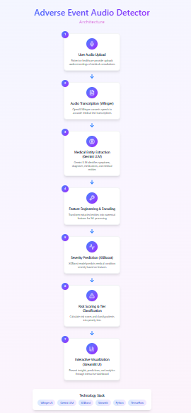
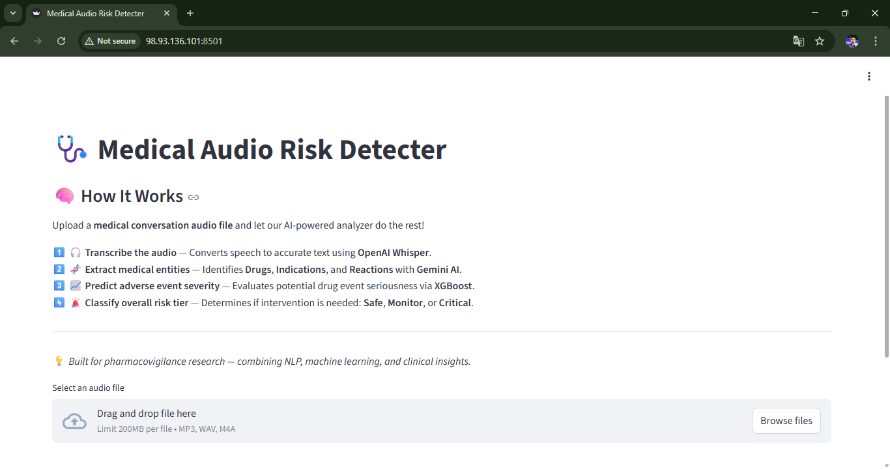
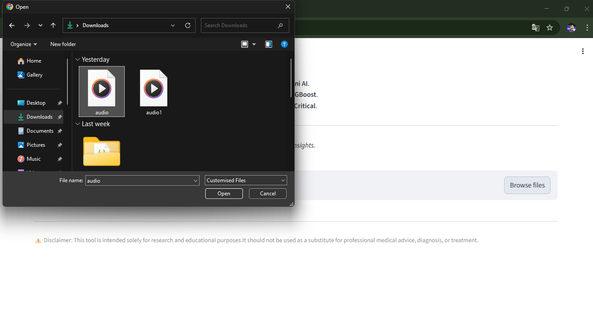
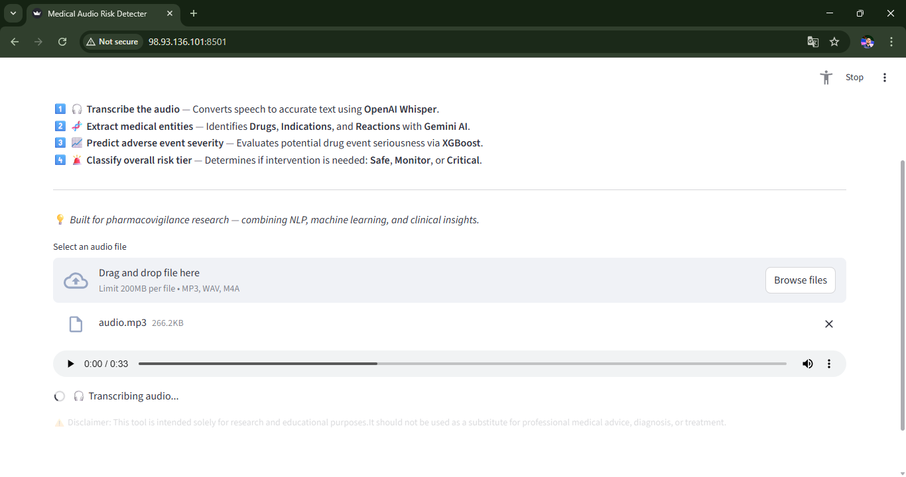
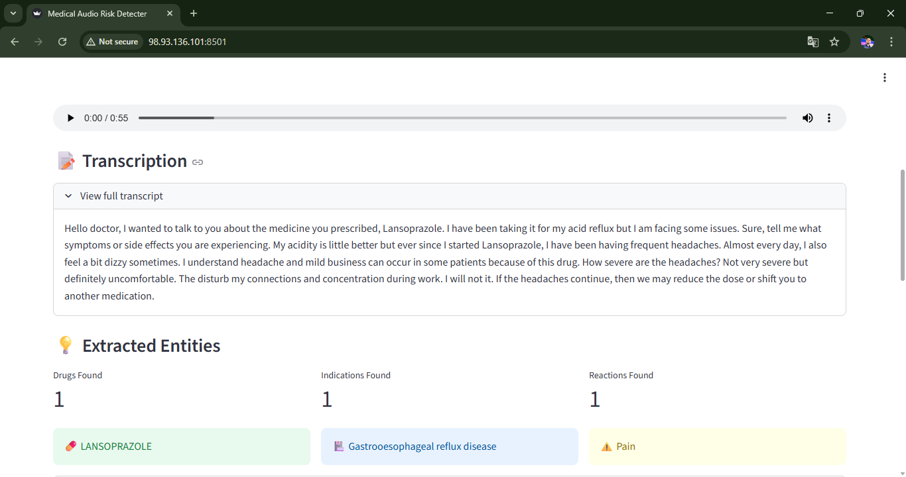

#  Adverse Medical Event Prediction from Phone Calls
# Team - CodeHolics

### Demo Video

A short demo video is available here: 

### Report: 

### Figma Links ⬇️ 
 
**INFORMATION ARCHITECTURE**: [Architecture Pipeline](https://amity-rabbit-85650432.figma.site/)

**INTERFACE SCREENS**: [Interface](https://quirky-cleat-87990483.figma.site/)

## 🚀 Problem Statement
Millions of conversations occur daily between patients and nurses or medical agents regarding medical conditions and medications. During these conversations, early indications of adverse medical events (AEs) may be present but often go unnoticed. Failure to detect such events in time can lead to severe health consequences.

This project aims to automatically identify and predict potential adverse medical events from recorded medical conversations to enable early intervention and improve patient safety.

## 💡 Solution Overview
We present an end-to-end AI-powered system that:
1. Transcribes medical phone calls using speech-to-text models
2. Extracts key medical entities (drugs, indications, reactions)
3. Performs feature engineering using adverse event historical data
4. Predicts the likelihood and severity of adverse events
5. Displays results through an interactive Streamlit dashboard

## 🧠 System Architecture

  

## ⚙️ Tech Stack
- **Python**
- **Whisper** – Speech-to-text transcription
- **LLM (Gemini / Prompt-based NLP)** – Medical entity extraction
- **XGBoost** – Adverse event prediction
- **Pandas / NumPy** – Data analysis & preprocessing
- **Streamlit** – User Interface

## 📊 Data Analysis
Before model training, extensive data analysis was performed on the adverse events repository:
- Drug–reaction frequency analysis
- Severity distribution analysis
- Reaction co-occurrence patterns
- Class imbalance analysis

These insights guided feature engineering and model selection.

## 🛠 Feature Engineering
Extracted entities are transformed into numerical features such as:
- Encoded drug identifiers
- Encoded medical indications
- Suspect role codes
- Reaction frequency statistics
- Historical severity metrics

The resulting feature matrix is used as input to the ML model.

## 📈 Model & Evaluation
- **Model**: XGBoost Classifier
- **Why XGBoost?**
  - Handles structured medical data effectively
  - Robust to missing values
  - Performs well on imbalanced datasets
  - Provides feature importance for explainability

## 🎛 Streamlit Application
Features:
- Upload recorded medical calls
- Real-time transcription
- Extracted entity visualization
- Adverse event risk score
- Severity classification (Low / Medium / High)

## 🔮 Future Scope
- Real-time call monitoring
- Multilingual conversation support
- Integration with EHR systems
- Human-in-the-loop medical validation

### Data Source:
- FAERS (FDA Adverse Event Reporting System)
- We worked on Year: 2021 (Q1–Q4)
- **Source**: [FAERS DataBase](https://open.fda.gov/data/faers/)
- FAERS Tables Used: DEMO : Patient demographics, DRUG : Drug information (Primary Suspect only),REAC : Adverse reactions, OUTC : Outcomes (death, hospitalization, etc.), INDI : Drug indications

### Data Pipeline:
- Automated ingestion of FAERS ASCII files
- Column normalization and cleaning
- Memory-optimized aggregation to avoid data explosion
- Case-level severity scoring using FAERS outcome codes
- Creation of a consolidated dataset for prediction
- (To handle large-scale FAERS data efficiently, reactions and outcomes were aggregated at case level before merging.)

### Quality Assurance (QA):

Testing Approaches Used:
- Manual Test Cases
- Automated Unit Tests

QA Coverage:
- Requirement validation
- Data integrity checks
- Severity score consistency
- Null and edge case handling

(Detailed QA documentation and test cases are available in the /qa folder.)

### Screenshots of UI:

- USER INTERFACE
  

  

- USER CLICKS ON BROWSE FILES AND SELECT THE AUDIO FILE

  

- PROCESSING STARTS - TRANSCRIPTION OF AUDIO (audio to text) and TRANSLATION (if audio is in another language it is converted to english)

  

  

- SYMPTOMS AND DRUGS ARE EXTRACTED

  

- The Output is obtained telling the risk of occurrence of adverse event.

  

  

Made By:
### Team: CodeHolics
YMCA - Batch of 2026

